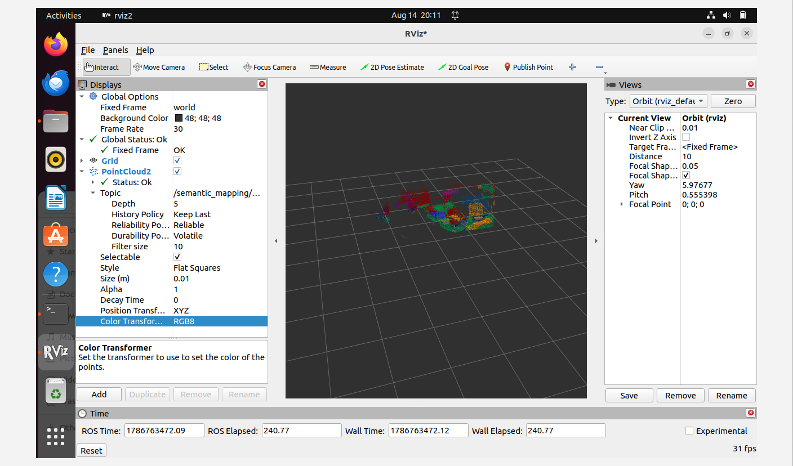
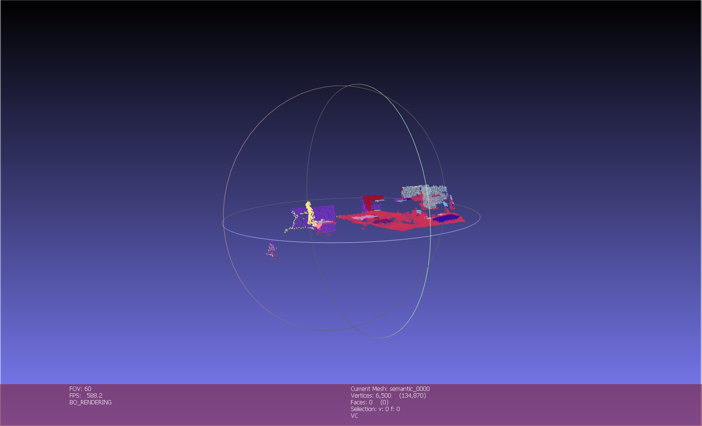
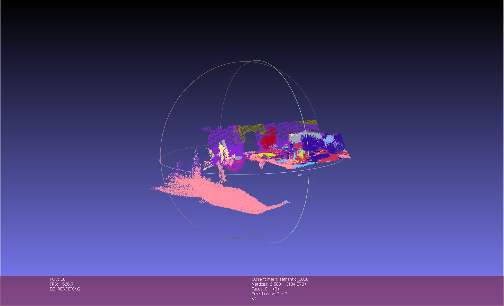
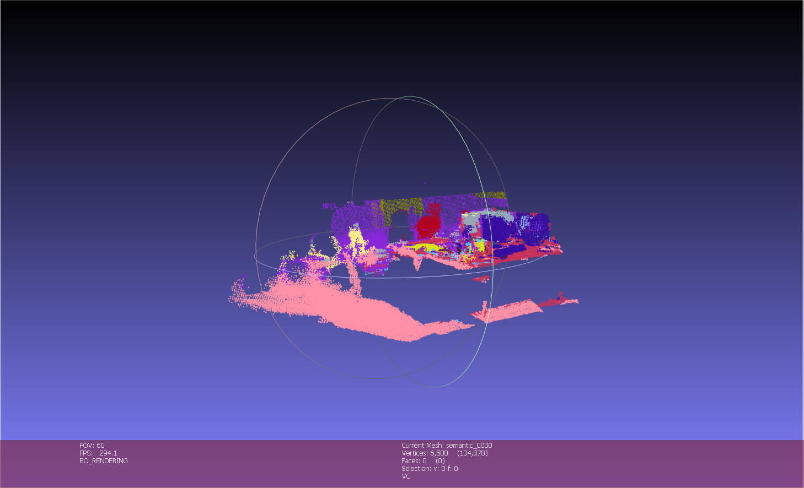
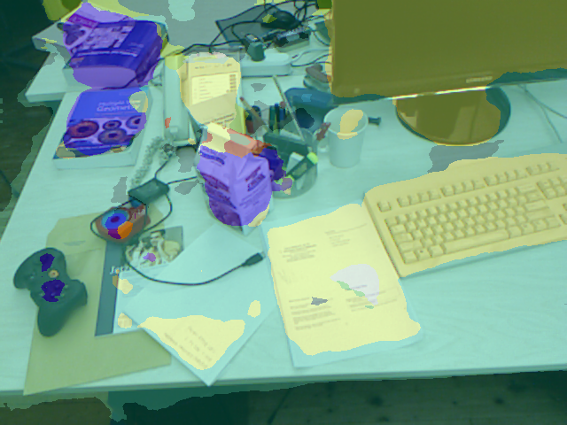

# Replayable RGB-D Perception and Semantic Mapping System

A modular RGB-D perception and semantic mapping system built with Python, C++17, and ROS 2. The pipeline replays synchronized RGB-D observations, performs Transformer-based semantic segmentation, projects semantic predictions into 3D, and incrementally fuses them into a persistent world-frame voxel map.

The system supports both an offline Python reference pipeline and a ROS 2 implementation with Python perception nodes, a C++ semantic-mapping backend, synchronized multi-stream processing, and live PointCloud2 visualization in RViz2.

---

## Demo

<!-- TODO: Replace with your final GIF or preview image -->

<p align="center">
  
</p>

The final ROS 2 pipeline incrementally builds and publishes a semantically labeled 3D voxel map from replayed RGB-D observations.

**RGB-D replay → semantic segmentation → synchronized 3D mapping → semantic voxel fusion → RViz2**

A video of the offline incremental mapping process is also available:

[▶ Full Incremental Mapping Demo](assets/incremental_mapping_demo.mp4)

---

## Overview

This project explores how RGB-D perception can be organized into a replayable and modular robotics mapping pipeline.

Instead of processing an entire sequence as a single offline point cloud, the system processes observations frame by frame:

1. Associate RGB, depth, and pose measurements by timestamp.
2. Run semantic segmentation on the RGB frame.
3. Backproject valid depth pixels into the camera frame.
4. Transform 3D points into the world frame using the associated camera pose.
5. Incrementally update a persistent semantic voxel map.
6. Fuse repeated semantic observations using prediction confidence.
7. Export intermediate or final RGB and semantic point clouds for visualization.

The current implementation focuses on **known-pose RGB-D semantic mapping** rather than full SLAM. Camera poses are provided by the dataset.

---

## System Architecture

```text
                TUM RGB-D Dataset
                       |
              rgbd_replay_node
                 (Python / ROS 2)
                  /     |     \
                RGB   Depth   Pose
                 |      |      |
                 |      |      |
    semantic_segmentation_node |
        (Python / ROS 2)       |
               |               |
      Labels + Confidence      |
               |               |
               +-------+-------+  
                       |
             semantic_mapping_node
                  (C++ / ROS 2)
                       |
          Exact-Time Stream Synchronization
                       |
          RGB-D Backprojection + SE(3)
                       |
          C++ Semantic Voxel Map
                       |
          Confidence-Weighted Fusion
                       |
             sensor_msgs/PointCloud2
                       |
                     RViz2
```
The perception stage remains in Python to leverage the PyTorch and Hugging Face ecosystem, while the persistent semantic mapping core is implemented in C++17 and integrated into a ROS 2 mapping node.

---

## Key Features

### RGB-D Dataset Association

- Parses timestamped RGB, depth, and ground-truth pose streams.
- Performs one-to-one RGB-depth association using timestamp differences.
- Associates each RGB-D observation with the nearest valid camera pose.
- Rejects associations outside configurable time thresholds.

### RGB-D Geometry

- Converts TUM depth images to metric depth.
- Backprojects valid depth pixels into 3D using camera intrinsics.
- Transforms camera-frame points into a shared world coordinate frame.
- Supports configurable pixel stride for faster experimentation.

### Semantic Perception

- Uses `nvidia/segformer-b0-finetuned-ade-512-512`.
- Produces per-pixel semantic labels and model confidence.
- Resizes network logits back to the original RGB resolution.
- Projects semantic labels and confidence values into the corresponding 3D observations.

### Incremental Semantic Voxel Mapping

The map is stored as a persistent voxel structure and updated frame by frame.

Each voxel maintains accumulated statistics including:

- mean 3D position,
- mean RGB color,
- observation count,
- confidence-weighted semantic label scores.

For each semantic class \(c\), the accumulated score inside a voxel is:

```text
score(c) = sum of model confidences supporting class c
```

The voxel label is selected from the class with the highest accumulated score.

The map also exports:

- semantic agreement,
- mean model confidence,
- number of observations per voxel.

This allows uncertain semantic regions to be identified instead of forcing every voxel into a confident semantic category.

### Replayable Mapping

The mapping pipeline can be run incrementally over a recorded RGB-D sequence.

Intermediate map snapshots can be exported after each update and rendered into a video showing the semantic map growing over time.

### ROS 2 Integration

The offline perception pipeline was extended into a multi-node ROS 2 system.

The replay node publishes synchronized:

- RGB images,
- depth images,
- camera poses.

The semantic segmentation node subscribes to RGB frames and publishes:

- per-pixel semantic labels,
- per-pixel confidence maps.

The C++ mapping node synchronizes RGB, depth, pose, label, and confidence messages using exact timestamps, backprojects valid RGB-D observations into 3D, transforms them into the world frame, and incrementally updates the semantic voxel map.

The fused map is published as `sensor_msgs/PointCloud2` and visualized live in RViz2.

| Topic | Message |
| --- | --- |
| `/rgbd_replay/rgb` | `sensor_msgs/Image` |
| `/rgbd_replay/depth` | `sensor_msgs/Image` |
| `/rgbd_replay/pose` | `geometry_msgs/PoseStamped` |
| `/semantic_segmentation/labels` | `sensor_msgs/Image` |
| `/semantic_segmentation/confidence` | `sensor_msgs/Image` |
| `/semantic_mapping/map` | `sensor_msgs/PointCloud2` |

### C++ Semantic Mapping Backend

The incremental semantic voxel-map core was first implemented and tested in Python, then ported to C++17.

The C++ implementation preserves the same voxel indexing and confidence-weighted fusion behavior as the Python reference while providing a reusable backend for the ROS 2 mapping node.

Cross-language parity was evaluated over:

- **80 RGB-D frames**
- **1.16M semantic observations**

The Python and C++ implementations produced equivalent voxel-map outputs across the evaluated sequence.

### Python vs. C++ Mapping Performance

| Implementation | Mapping Runtime |
| --- | ---: |
| Python | 5.526 s |
| C++17 | 2.997 s |
| Speedup | **1.84×** |
| Runtime reduction | **45.8%** |

---

## Example Results

### Incremental Map Growth

<!-- TODO: Replace these paths with your actual screenshots -->

| Early | Middle | Final |
| --- | --- | --- |
|  |  |  |

### Final Semantic Map

<!-- TODO -->

<p align="center">
  
</p>

The map preserves the world-frame geometry accumulated from multiple RGB-D observations while fusing semantic predictions across frames.

Local semantic inconsistencies remain around object boundaries and visually ambiguous regions. These are treated as uncertainty in the current MVP rather than being aggressively smoothed.

---

## Dataset

The current implementation is tested on the:

**TUM RGB-D Dataset — `freiburg1_xyz`**

The dataset provides:

- timestamped RGB images,
- timestamped depth images,
- ground-truth camera trajectories.

Dataset files are **not included in this repository**.

After downloading the sequence, place it under:

```text
data/raw/rgbd_dataset_freiburg1_xyz/
```

Expected structure:

```text
rgbd_dataset_freiburg1_xyz/
├── rgb/
├── depth/
├── rgb.txt
├── depth.txt
└── groundtruth.txt
```

---

## Project Structure

```text
rgbd-semantic-mapping/
├── cpp/
│   ├── include/
│   │   └── rgbd_mapping/
│   │       └── semantic_voxel_map.hpp
│   ├── src/
│   │   └── semantic_voxel_map.cpp
│   ├── tests/
│   └── CMakeLists.txt
│
├── ros2_ws/
│   └── src/
│       ├── rgbd_replay/
│       ├── semantic_segmentation/
│       └── semantic_mapping/
│
├── src/
│   └── rgbd_mapping/
│       ├── datasets/
│       ├── geometry/
│       ├── mapping/
│       └── semantics/
│
├── scripts/
│   ├── incremental_semantic_map_construction.py
│   └── render_incremental_demo.py
│
├── tests/
├── assets/
├── requirements.txt
├── setup_ros_env.sh
└── README.md
```

---

## Installation

### 1. Create a virtual environment

```bash
python3 -m venv .venv
source .venv/bin/activate
```

### 2. Upgrade pip

```bash
python -m pip install --upgrade pip
```

### 3. Install dependencies

```bash
python -m pip install -r requirements.txt
```

Core dependencies include:

- NumPy
- SciPy
- PyTorch
- TorchVision
- Transformers
- Pillow
- ImageIO
- Matplotlib
- Open3D
- PyTest

For CPU-only Open3D rendering on Linux:

```bash
python -m pip install open3d-cpu
```

The demo renderer also requires FFmpeg support:

```bash
python -m pip install "imageio[ffmpeg]"
```

### 4. ROS 2 Environment

The ROS integration was developed and tested with:

- Ubuntu 22.04
- ROS 2 Humble
- Python 3
- C++17
- CMake / colcon

Source ROS 2 and activate the Python environment:

```bash
source /opt/ros/humble/setup.bash

source .venv/bin/activate

export PYTHONPATH="$PWD/src:$PYTHONPATH"
```

Build the ROS 2 workspace:

```bash
cd ros2_ws

../.venv/bin/colcon build --symlink-install

source install/setup.bash
```

> **Note:** The ROS 2 Humble `cv_bridge` environment used in this project requires a NumPy 1.x-compatible Python environment. The tested setup uses NumPy 1.26.4.

---

## Running the Incremental Mapping Pipeline

From the repository root:

```bash
PYTHONPATH=src python -m scripts.incremental_semantic_map_construction
```

The script processes the selected RGB-D frames sequentially and updates a persistent `SemanticVoxelMap`.

Example outputs include:

```text
outputs/demo_run/
├── snapshots/
│   ├── snapshot_0000.npz
│   ├── snapshot_0005.npz
│   └── ...
│
├── rgb/
│   ├── rgb_0000.png
│   └── ...
│
├── semantic_2d/
│   ├── semantic_0000.png
│   └── ...
│
└── ...
```

Each snapshot stores the current voxel map state, including:

```text
points
rgb_colors
labels
semantic_agreement
mean_model_confidence
observation_counts
```

---

## Rendering the Incremental Demo

A map-only video can be rendered with:

```bash
EGL_PLATFORM=surfaceless \
python scripts/render_incremental_demo.py \
    --run-dir outputs/demo_run \
    --layout map \
    --fps 5
```

A three-panel visualization can be rendered with:

```bash
EGL_PLATFORM=surfaceless \
python scripts/render_incremental_demo.py \
    --run-dir outputs/demo_run \
    --layout triple \
    --fps 5
```

The three-panel demo contains:

```text
RGB Input
|
+-- 2D Semantic Prediction
|
+-- Incrementally Fused 3D Semantic Map
```

On headless Linux systems, Open3D may require software EGL rendering.

---

## Testing and Validation

The mapping implementation was validated at multiple levels.

### Python Unit Tests

Python tests verify:

- persistent voxel accumulation,
- batch/incremental equivalence,
- confidence-weighted semantic fusion,
- correct voxel indexing,
- empty-update handling.

### C++ Unit Tests

The C++ backend includes corresponding tests for semantic voxel-map behavior.

### Python / C++ Parity

Frozen semantic observations were replayed through both implementations.

Across 80 frames and approximately 1.16 million observations, the Python and C++ implementations produced equivalent voxel topology, semantic labels, observation counts, and fused outputs.

---

## Semantic Fusion

Suppose one voxel receives the following observations:

```text
monitor: 0.80
monitor: 0.60
wall:    0.70
```

The accumulated class scores become:

```text
monitor = 1.40
wall    = 0.70
```

The final semantic label is therefore `monitor`.

The semantic agreement is:

```text
1.40 / (1.40 + 0.70) = 0.667
```

while the mean model confidence is:

```text
(0.80 + 0.60 + 0.70) / 3 = 0.70
```

These quantities distinguish two different forms of uncertainty:

- **model confidence** — how confident the segmentation model is,
- **semantic agreement** — how consistently repeated observations support the same class.

---

## Running the ROS 2 Pipeline

Prepare the environment:

```bash
source setup_ros_env.sh
```

Run the RGB-D replay node:

```bash
ros2 run rgbd_replay rgbd_replay_node
```

Run the C++ semantic mapping node:

```bash
ros2 run semantic_mapping semantic_mapping_node
```

For RViz2 visualization:

```bash
rviz2
```

Set:
```text
Fixed Frame: map
PointCloud2 Topic: /semantic_mapping/map
Color Transformer: RGB8
```

The published PointCloud2 uses semantic-label colors rather than raw camera RGB colors.

---

## Current MVP Status

### Completed

- [x] TUM RGB-D dataset parsing
- [x] RGB-depth timestamp association
- [x] RGB-D-pose association
- [x] Metric depth conversion
- [x] Camera-frame RGB-D backprojection
- [x] Camera-to-world coordinate transformation
- [x] Multi-frame RGB point cloud reconstruction
- [x] Voxel downsampling
- [x] SegFormer semantic segmentation
- [x] Semantic RGB-D backprojection
- [x] Confidence-weighted semantic voxel fusion
- [x] Persistent incremental semantic voxel map
- [x] Frame-by-frame RGB-D replay
- [x] Intermediate map snapshot export
- [x] Incremental semantic mapping video generation
- [x] Unit tests for incremental voxel accumulation
- [x] C++17 semantic voxel-map backend
- [x] Python/C++ mapping parity validation
- [x] ROS 2 RGB-D dataset replay
- [x] ROS 2 semantic segmentation node
- [x] Multi-stream timestamp synchronization
- [x] ROS 2 C++ semantic mapping node
- [x] PointCloud2 semantic map publishing
- [x] RViz2 live semantic-map visualization

---

## Current Limitations

This project is currently a semantic mapping MVP rather than a complete SLAM system.

### Known camera poses

Camera poses are obtained from the TUM RGB-D ground-truth trajectory.

The current system therefore evaluates:

```text
perception + projection + map fusion
```

rather than estimating camera motion online.

### Semantic segmentation errors

SegFormer predictions can be inconsistent around:

- object boundaries,
- thin objects,
- reflective surfaces,
- visually similar indoor objects.

Multi-frame confidence-weighted fusion improves temporal consistency but cannot correct systematic segmentation errors.

### RGB-D noise

Depth noise and missing measurements can cause local geometric and semantic artifacts, especially near object boundaries.

### CPU inference

The current MVP is designed to run without requiring a GPU. Semantic segmentation is therefore the primary runtime bottleneck.

---

## Performance

<!-- TODO: Replace these values after running the final demo -->

| Metric | Result |
| --- | ---: |
| Dataset | TUM RGB-D `freiburg1_xyz` |
<!-- | Frames processed | TODO |
| Pixel stride | TODO | -->
| Voxel resolution | 0.02 m |
<!-- | Raw semantic observations | TODO |
| Final map voxels | TODO |
| Mean observations / voxel | TODO |
| Mean semantic agreement | TODO |
| Unknown voxel ratio | TODO |
| Mean SegFormer inference time | TODO ms/frame |
| Mean voxel-map update time | TODO ms/frame | -->
| Semantic observations | 1.16M |
| Python mapping runtime | 5.526 s |
| C++ mapping runtime | 2.997 s |
| C++ speedup | **1.84×** |

Semantic segmentation is currently executed on CPU and remains the primary end-to-end runtime bottleneck.

---

## Design Goals

The project emphasizes:

- **modularity** — dataset, geometry, semantics, and mapping are separated,
- **replayability** — recorded sequences can be processed deterministically,
- **incremental state** — the map evolves frame by frame instead of being rebuilt from all historical observations,
- **inspectability** — intermediate semantic statistics and map snapshots can be exported,
- **robotics-oriented interfaces** — components are structured so that offline replay can later be replaced by live sensor streams.

---

## Potential Extensions

Possible future extensions include:

- GPU-accelerated semantic inference,
- live RGB-D camera input,
- online pose estimation / SLAM,
- dynamic-object handling,
- semantic spatial regularization,
- downstream semantic-map queries for navigation or planning.

---

## Tech Stack

**Languages**

- Python
- C++ 17

**Robotics / Middleware**

- ROS 2 Humble
- rclpy / rclcpp
- message_filters
- cv_bridge
- PointCloud2
- RViz2

**Perception / ML**

- PyTorch
- Hugging Face Transformers
- SegFormer

**Geometry / Mapping**

- NumPy
- RGB-D backprojection
- rigid-body transformations
- voxel-based semantic fusion

**Build / Development**

- CMake
- colcon
- Linux
- Git

**Visualization**

- RViz2
- Open3D
- MeshLab
- ImageIO / FFmpeg

**Testing**

- PyTest
- C++ unit tests
- Python/C++ parity testing

---

## Acknowledgements

This project uses the TUM RGB-D benchmark dataset and the pretrained SegFormer ADE20K semantic segmentation model.

The current implementation is intended as a modular robotics perception and semantic mapping project for experimentation with replayable RGB-D pipelines.