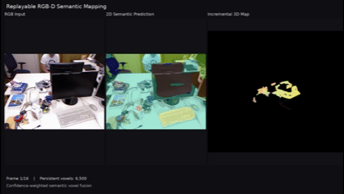

# Replayable RGB-D Perception and Semantic Mapping System

A modular RGB-D perception and semantic mapping pipeline that replays timestamped RGB-D sequences, projects 2D semantic predictions into 3D, and incrementally fuses them into a persistent world-frame voxel map.

The current MVP uses synchronized RGB, depth, and camera poses from the TUM RGB-D dataset, SegFormer for semantic segmentation, and confidence-weighted voxel fusion for multi-frame semantic mapping.

---

## Demo

<!-- TODO: Replace with your final GIF or preview image -->

<p align="center">
  
</p>

The demo shows the mapping pipeline running incrementally:

**RGB input → 2D semantic segmentation → 3D projection → persistent semantic voxel map**

A full-resolution video is available here:

[▶ Full Incremental Mapping Demo](assets/incremental_mapping_demo.mp4)

---

## Overview

This project explores how RGB-D perception can be organized into a replayable and modular robotics mapping pipeline.

Instead of processing an entire sequence as a single offline point cloud, the system processes observations frame by frame:

1. Associate RGB, depth, and pose measurements by timestamp.
2. Run semantic segmentation on the RGB frame.
3. Backproject valid depth pixels into the camera frame.
4. Transform 3D points into the world frame using the associated camera pose.
5. Incrementally update a persistent semantic voxel map.
6. Fuse repeated semantic observations using prediction confidence.
7. Export intermediate or final RGB and semantic point clouds for visualization.

The current implementation focuses on **known-pose RGB-D semantic mapping** rather than full SLAM. Camera poses are provided by the dataset.

---

## Pipeline

```text
Timestamped RGB / Depth / Pose
            |
     Sensor Association
            |
    RGB Semantic Segmentation
        (SegFormer)
            |
      RGB-D Backprojection
            |
     Camera -> World Transform
            |
   Incremental Voxel Map Update
            |
 Confidence-Weighted Semantic Fusion
            |
 Persistent 3D Semantic Map
```

---

## Key Features

### RGB-D Dataset Association

- Parses timestamped RGB, depth, and ground-truth pose streams.
- Performs one-to-one RGB-depth association using timestamp differences.
- Associates each RGB-D observation with the nearest valid camera pose.
- Rejects associations outside configurable time thresholds.

### RGB-D Geometry

- Converts TUM depth images to metric depth.
- Backprojects valid depth pixels into 3D using camera intrinsics.
- Transforms camera-frame points into a shared world coordinate frame.
- Supports configurable pixel stride for faster experimentation.

### Semantic Perception

- Uses `nvidia/segformer-b0-finetuned-ade-512-512`.
- Produces per-pixel semantic labels and model confidence.
- Resizes network logits back to the original RGB resolution.
- Projects semantic labels and confidence values into the corresponding 3D observations.

### Incremental Semantic Voxel Mapping

The map is stored as a persistent voxel structure and updated frame by frame.

Each voxel maintains accumulated statistics including:

- mean 3D position,
- mean RGB color,
- observation count,
- confidence-weighted semantic label scores.

For each semantic class \(c\), the accumulated score inside a voxel is:

```text
score(c) = sum of model confidences supporting class c
```

The voxel label is selected from the class with the highest accumulated score.

The map also exports:

- semantic agreement,
- mean model confidence,
- number of observations per voxel.

This allows uncertain semantic regions to be identified instead of forcing every voxel into a confident semantic category.

### Replayable Mapping

The mapping pipeline can be run incrementally over a recorded RGB-D sequence.

Intermediate map snapshots can be exported after each update and rendered into a video showing the semantic map growing over time.

---

## Example Results

### Incremental Map Growth

<!-- TODO: Replace these paths with your actual screenshots -->

| Early | Middle | Final |
| --- | --- | --- |
|  |  |  |

### Final Semantic Map

<!-- TODO -->

<p align="center">
  
</p>

The map preserves the world-frame geometry accumulated from multiple RGB-D observations while fusing semantic predictions across frames.

Local semantic inconsistencies remain around object boundaries and visually ambiguous regions. These are treated as uncertainty in the current MVP rather than being aggressively smoothed.

---

## Dataset

The current implementation is tested on the:

**TUM RGB-D Dataset — `freiburg1_xyz`**

The dataset provides:

- timestamped RGB images,
- timestamped depth images,
- ground-truth camera trajectories.

Dataset files are **not included in this repository**.

After downloading the sequence, place it under:

```text
data/raw/rgbd_dataset_freiburg1_xyz/
```

Expected structure:

```text
rgbd_dataset_freiburg1_xyz/
├── rgb/
├── depth/
├── rgb.txt
├── depth.txt
└── groundtruth.txt
```

---

## Project Structure

```text
rgbd-semantic-mapping/
├── configs/
│
├── data/
│   └── raw/
│
├── scripts/
│   ├── incremental_semantic_map_construction.py
│   └── render_incremental_demo.py
│
├── src/
│   └── rgbd_mapping/
│       ├── datasets/
│       │   └── ...
│       │
│       ├── geometry/
│       │   └── ...
│       │
│       ├── mapping/
│       │   ├── semantic_voxel.py
│       │   └── semantic_voxel_map.py
│       │
│       └── semantics/
│           └── ...
│
├── tests/
│   └── ...
│
├── assets/
│   └── ...
│
├── requirements.txt
└── README.md
```

---

## Installation

### 1. Create a virtual environment

```bash
python3 -m venv .venv
source .venv/bin/activate
```

### 2. Upgrade pip

```bash
python -m pip install --upgrade pip
```

### 3. Install dependencies

```bash
python -m pip install -r requirements.txt
```

Core dependencies include:

- NumPy
- SciPy
- PyTorch
- TorchVision
- Transformers
- Pillow
- ImageIO
- Matplotlib
- Open3D
- PyTest

For CPU-only Open3D rendering on Linux:

```bash
python -m pip install open3d-cpu
```

The demo renderer also requires FFmpeg support:

```bash
python -m pip install "imageio[ffmpeg]"
```

---

## Running the Incremental Mapping Pipeline

From the repository root:

```bash
PYTHONPATH=src python -m scripts.incremental_semantic_map_construction
```

The script processes the selected RGB-D frames sequentially and updates a persistent `SemanticVoxelMap`.

Example outputs include:

```text
outputs/demo_run/
├── snapshots/
│   ├── snapshot_0000.npz
│   ├── snapshot_0005.npz
│   └── ...
│
├── rgb/
│   ├── rgb_0000.png
│   └── ...
│
├── semantic_2d/
│   ├── semantic_0000.png
│   └── ...
│
└── ...
```

Each snapshot stores the current voxel map state, including:

```text
points
rgb_colors
labels
semantic_agreement
mean_model_confidence
observation_counts
```

---

## Rendering the Incremental Demo

A map-only video can be rendered with:

```bash
EGL_PLATFORM=surfaceless \
python scripts/render_incremental_demo.py \
    --run-dir outputs/demo_run \
    --layout map \
    --fps 5
```

A three-panel visualization can be rendered with:

```bash
EGL_PLATFORM=surfaceless \
python scripts/render_incremental_demo.py \
    --run-dir outputs/demo_run \
    --layout triple \
    --fps 5
```

The three-panel demo contains:

```text
RGB Input
|
+-- 2D Semantic Prediction
|
+-- Incrementally Fused 3D Semantic Map
```

On headless Linux systems, Open3D may require software EGL rendering.

---

## Testing

Run the unit tests from the repository root:

```bash
PYTHONPATH=src pytest tests -v
```

The semantic voxel map tests verify that:

- multiple updates accumulate into persistent voxels,
- batch and incremental updates produce equivalent results,
- observations within the same voxel are fused correctly,
- semantic scores are accumulated using model confidence,
- negative coordinates use floor-based voxel indexing,
- empty observations do not corrupt the persistent map.

---

## Semantic Fusion

Suppose one voxel receives the following observations:

```text
monitor: 0.80
monitor: 0.60
wall:    0.70
```

The accumulated class scores become:

```text
monitor = 1.40
wall    = 0.70
```

The final semantic label is therefore `monitor`.

The semantic agreement is:

```text
1.40 / (1.40 + 0.70) = 0.667
```

while the mean model confidence is:

```text
(0.80 + 0.60 + 0.70) / 3 = 0.70
```

These quantities distinguish two different forms of uncertainty:

- **model confidence** — how confident the segmentation model is,
- **semantic agreement** — how consistently repeated observations support the same class.

---

## Current MVP Status

### Completed

- [x] TUM RGB-D dataset parsing
- [x] RGB-depth timestamp association
- [x] RGB-D-pose association
- [x] Metric depth conversion
- [x] Camera-frame RGB-D backprojection
- [x] Camera-to-world coordinate transformation
- [x] Multi-frame RGB point cloud reconstruction
- [x] Voxel downsampling
- [x] SegFormer semantic segmentation
- [x] Semantic RGB-D backprojection
- [x] Confidence-weighted semantic voxel fusion
- [x] Persistent incremental semantic voxel map
- [x] Frame-by-frame RGB-D replay
- [x] Intermediate map snapshot export
- [x] Incremental semantic mapping video generation
- [x] Unit tests for incremental voxel accumulation

### Experimental / Optional

- [x] Coarse semantic label remapping
- [ ] Final uncertainty-to-unknown threshold selection
- [ ] Lightweight spatial semantic refinement

---

## Current Limitations

This project is currently a semantic mapping MVP rather than a complete SLAM system.

### Known camera poses

Camera poses are obtained from the TUM RGB-D ground-truth trajectory.

The current system therefore evaluates:

```text
perception + projection + map fusion
```

rather than estimating camera motion online.

### Semantic segmentation errors

SegFormer predictions can be inconsistent around:

- object boundaries,
- thin objects,
- reflective surfaces,
- visually similar indoor objects.

Multi-frame confidence-weighted fusion improves temporal consistency but cannot correct systematic segmentation errors.

### RGB-D noise

Depth noise and missing measurements can cause local geometric and semantic artifacts, especially near object boundaries.

### CPU inference

The current MVP is designed to run without requiring a GPU. Semantic segmentation is therefore the primary runtime bottleneck.

---

## Performance

<!-- TODO: Replace these values after running the final demo -->

| Metric | Result |
| --- | ---: |
| Dataset | TUM RGB-D `freiburg1_xyz` |
| Frames processed | TODO |
| Pixel stride | TODO |
| Voxel resolution | 0.02 m |
| Raw semantic observations | TODO |
| Final map voxels | TODO |
| Mean observations / voxel | TODO |
| Mean semantic agreement | TODO |
| Unknown voxel ratio | TODO |
| Mean SegFormer inference time | TODO ms/frame |
| Mean voxel-map update time | TODO ms/frame |

---

## Design Goals

The project emphasizes:

- **modularity** — dataset, geometry, semantics, and mapping are separated,
- **replayability** — recorded sequences can be processed deterministically,
- **incremental state** — the map evolves frame by frame instead of being rebuilt from all historical observations,
- **inspectability** — intermediate semantic statistics and map snapshots can be exported,
- **robotics-oriented interfaces** — components are structured so that offline replay can later be replaced by live sensor streams.

---

## Roadmap

Potential extensions include:

- ROS2 RGB-D sensor replay,
- live `sensor_msgs/Image` and `PointCloud2` interfaces,
- C++ semantic voxel-map backend,
- online camera pose estimation / SLAM integration,
- semantic spatial regularization,
- dynamic-object handling,
- semantic map queries for downstream planning,
- GPU-accelerated inference.

---

## Tech Stack

**Languages**

- Python

**Perception / ML**

- PyTorch
- Hugging Face Transformers
- SegFormer

**Geometry / Mapping**

- NumPy
- RGB-D backprojection
- rigid-body transformations
- voxel-based semantic fusion

**Visualization**

- Open3D
- MeshLab
- ImageIO / FFmpeg

**Testing**

- PyTest

---

## Acknowledgements

This project uses the TUM RGB-D benchmark dataset and the pretrained SegFormer ADE20K semantic segmentation model.

The current implementation is intended as a modular robotics perception and semantic mapping project for experimentation with replayable RGB-D pipelines.